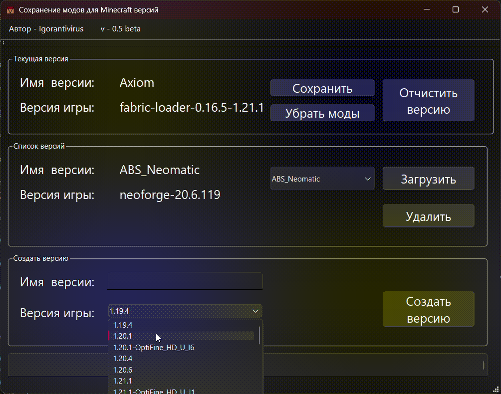

<h1 align="center">Mine-Mod-Versions-With-Interface</h1>

[](README_RU.md)

<h2>Description</h2>

A desktop application for easy switching between Minecraft mods.

[🔗 Link to a console version](#)

<h2>Application Preview</h2>



<h2>Dependencies</h2>

Programming language: **C++20**

Libraries:
* [Qt6](https://www.qt.io/product/qt6) - Framework for application design

<h2>Key Features</h2>

* **Multiple mod setups**
    The application allows you to store different mod setups for the same Minecraft version and easily switch between them.
* **Configuration preservation**
    When saving a setup, all auxiliary mod files are preserved, ensuring that mod configurations remain intact.
* **Version and mod management**
    You can remove mods and view available Minecraft versions.

<h2>In Development</h2>

* English localization  
* Support for locating the Minecraft folder on Linux  
  * Currently, `src/ProgrammPathMeneger.hpp` searches for the Windows AppData folder. **Linux support is in progress.**

<h2>Installation and Run</h2>

1. **Install all dependencies**
   * Install Qt6 and make sure it is available in CMake
2. **Clone the repository**
   ```bash
   git clone "https://github.com/Igorantivirus/Mine-Mods-Versions-With-Interface"
   cd Mine-Mods-Versions-With-Interface
   ```
3. **Configure CMake**
   ```bash
   cmake -B build
   ```
4. **Build the project**
   ```bash
    cmake --build build --config Release

<h2>License</h2>

MIT License