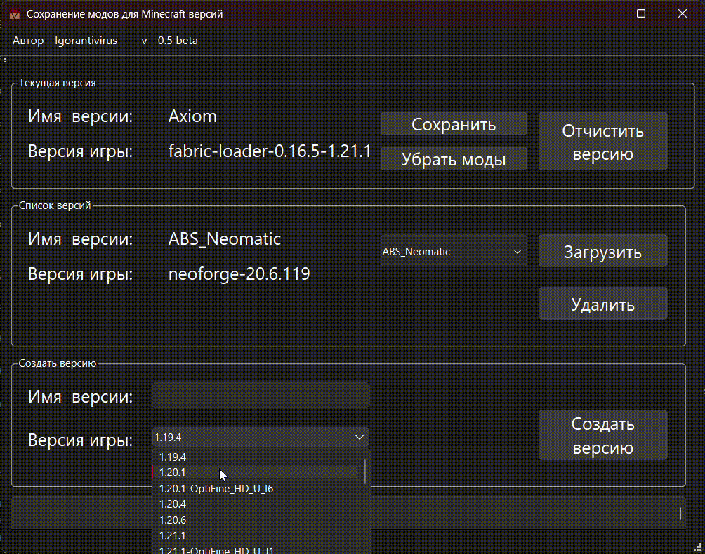

<h1 align="center">Mine-Mod-Versions-With-Interface</h1>

[](README.md)

<h2>Описание</h2>

Desktop'ное приложение для простого переключения модов для майнкрафта.

<h2>Вид приложения</h2>



<h2>Зависимости</h2>

Язык программирования: **С++20**

Библиотеки:
* [Qt6](https://www.qt.io/product/qt6) - Фреймворк для дизайна приложения

<h2>Ключевые особенности</h2>

* **Хранение сборок:**
    Приложение позволяет для одной версии майнкрафта хранить разные сборки модов, которые легко переключать.
* **Сохранение настроек**
    При сохранении сборки сохраняется все вспомогательные файлы модов, благодаря чему настройки модов не слетают.
* **Просмотр версий и модов**
        Есть возможность убрать моды, просматривать версии майнкрафта.

<h2>В разработке</h2>

* Английская локализация
* Поддержка нахождения minecraft папки в Linux
  * В `src/ProgrammPathMeneger.hpp` идёт поиск папки AppData из Windows, **Linux поддержка в разработке**

<h2>Установка и запуск</h2>

1. **Установите все зависимости**
   * Установите Qt6 и убедитесь, что он доступен в Cmake
2. **Клонируйте репозиторий**
   ```bash
   git clone "https://github.com/Igorantivirus/Mine-Mods-Versions-With-Interface"
   cd Mine-Mods-Versions-With-Interface
   ```
3. **Сконфигурируйте Cmake**
   ```bash
   cmake -B build
   ```
4. **Соберите проект**
   ```bash
    cmake --build build --config Release
   ```

<h2>Лицензия</h2>

**MIT Лицензия**
